<div align="center">

# 🛡️ Passive Mine Detection and Classification
### Hệ thống hỗ trợ phát hiện và phân loại vật thể chôn ngầm


[](https://python.org)
[](https://streamlit.io)
[](https://scikit-learn.org)
[](LICENSE)
[](https://huggingface.co/spaces/Naut1507/passive-mine-detection-and-classification)

</div>

---

> ### ⚠️ GIỚI HẠN AN TOÀN
>
> Hệ thống **chỉ hỗ trợ sắp xếp thứ tự ưu tiên đào**, không xác định vùng an toàn.
> Mọi tín hiệu **vẫn phải được đào kiểm tra đầy đủ** theo quy trình IMAS.
> Mô hình huấn luyện trên **338 mẫu phòng thí nghiệm**, không phải bãi mìn thật.

---

## Tổng quan

Đề tài phản biện và đánh giá lại bài báo:

> Yilmaz, C., Kahraman, H. T., & Söyler, S. (2018). *Passive Mine Detection and
> Classification Method Based on Hybrid Model*. **IEEE Access**, 6, 47870–47888.
> DOI: [10.1109/ACCESS.2018.2866538](https://doi.org/10.1109/ACCESS.2018.2866538)

Bài báo công bố **98,2% phát hiện** và **85,8% phân loại**. Đề tài phát hiện
**hai nguồn thổi phồng độc lập** và xây dựng quy trình đánh giá trung thực.

---

## Kết quả chính

### Hai nguồn lạc quan hoá

| Nguồn | Cơ chế | Mức thổi phồng |
|---|---|:---:|
| **Rò rỉ hàm thích nghi** | GA tối ưu trọng số trên chính tập test (Công thức 3 + Thuật toán 1) | 5–7 điểm |
| **Giao thức đánh giá** | Lưới giai thừa 12×6×5, chỉ 30 vật thể vật lý; chia ngẫu nhiên làm cùng vật thể nằm cả train lẫn test | 6–12 điểm |

### Phân rã khoảng cách

| Mức đánh giá | Phát hiện | Phân loại 5 lớp |
|---|:---:|:---:|
| **Bài báo công bố** | 98,2% | 85,8% |
| Tái hiện có rò rỉ + CV ngẫu nhiên | 95,6% | ~63–67% |
| Bỏ rò rỉ, giữ CV ngẫu nhiên | 91,0% ± 3,0 | ~59,4% ± 5,8 |
| **Bỏ rò rỉ + tách theo loại đất (P2)** | **83,1%** | **47,6%** |
| Baseline đa số (không học gì) | **79,0%** | 21,0% |

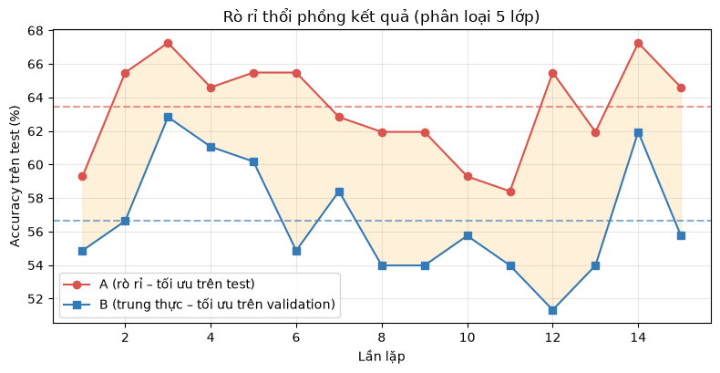

### Hiệu năng sản phẩm

| Chỉ số | Giá trị |
|---|:---:|
| Phân loại 5 lớp (CV) | **59,5%** |
| Recall phát hiện mìn (CV) | **93,6%** |
| Ngưỡng ưu tiên (CV) | **0,1487** |
| Giữ recall 100% trên dữ liệu mới | ~50% lần thử |

### So sánh mô hình

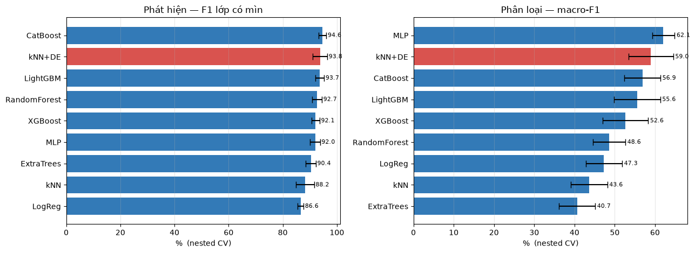
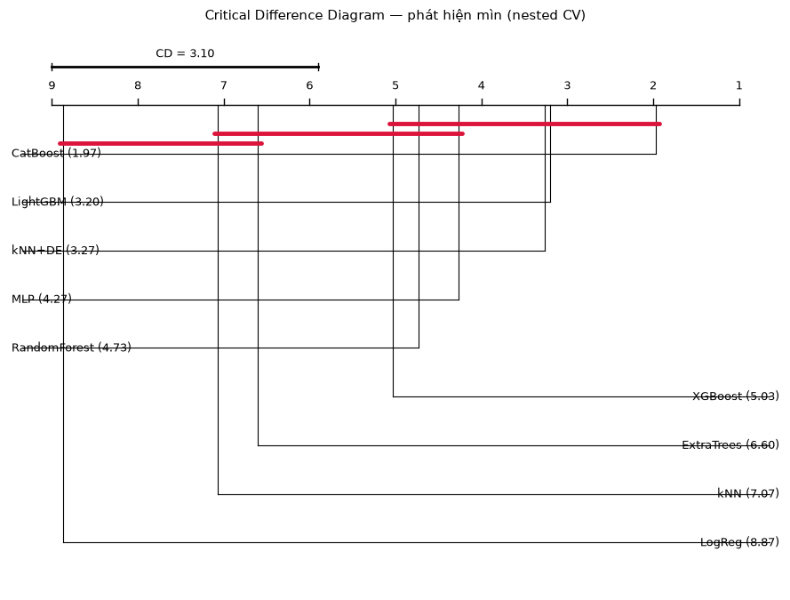

Kiểm định Friedman p ≈ 10⁻¹⁴. Hậu kiểm Nemenyi (CD ≈ 2,33): nhóm đỉnh gồm
k-NN+DE, CatBoost, LightGBM, MLP **không tách biệt được** — nút thắt là dữ
liệu ít, không phải lựa chọn thuật toán.

### Giải thích mô hình

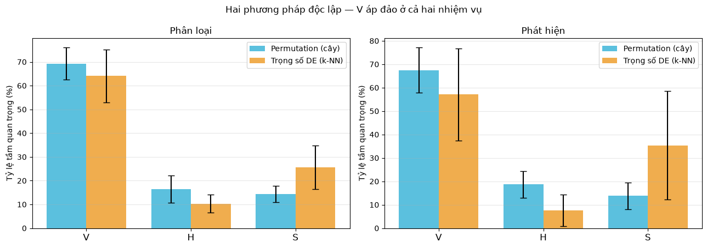
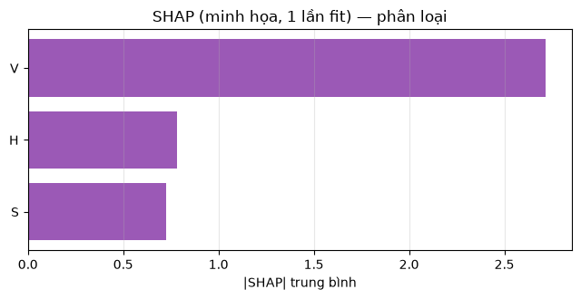

**V (điện áp dị thường từ) áp đảo** ở cả permutation importance lẫn SHAP,
nhất quán với lý giải vật lý.

---

## Demo

🤗 **[Hugging Face Space](https://huggingface.co/spaces/Naut1507/passive-mine-detection-and-classification)**

**Cách dùng nhanh:**
1. Vào tab **Dự đoán hàng loạt**
2. Bấm **Dùng file mẫu**
3. Xem bảng xếp hạng → **Bản đồ rủi ro** → **Tổng quan**
4. Tải kết quả Excel

---

## Cài đặt và chạy local

```bash
git clone https://github.com/tuan1507/passive-mine-detection-and-classification.git
cd passive-mine-detection-and-classification/Notebook/product_v3

python -m venv .venv
# Windows:
.venv\Scripts\activate
# Linux/macOS:
source .venv/bin/activate

pip install -r requirements.txt

# Huấn luyện mô hình (1 lần, ~30 giây)
python train_final.py

# Chạy app
streamlit run Home.py
```

Truy cập **http://localhost:8501**

> **Tự phục hồi:** Nếu `model.pkl` bị thiếu hoặc lệch phiên bản, app tự
> huấn luyện lại một lần khi khởi động.

---

## Cấu trúc dự án

```
passive-mine-detection-and-classification/
│
├── Notebook/
│   ├── product_v3/                  # Ứng dụng Streamlit
│   │   ├── Home.py                  # Entry point
│   │   ├── core.py                  # Logic lõi: train, predict, threshold
│   │   ├── train_final.py           # Huấn luyện → models/model.pkl
│   │   ├── requirements.txt
│   │   ├── Dockerfile
│   │   ├── pages/
│   │   │   ├── 0_Home_page.py       # Trang chủ + thông tin mô hình
│   │   │   ├── 1_Du_doan_hang_loat.py
│   │   │   ├── 2_Ban_do_rui_ro.py
│   │   │   ├── 3_Tong_quan.py
│   │   │   └── 4_Thu_don_le.py
│   │   └── data/
│   │       ├── raw/Mine_Dataset.xls
│   │       ├── sample_batch.xlsx
│   │       └── sample_batch.csv
│   │
│   ├── 01_kham_pha.ipynb            # EDA
│   ├── 02_tai_hien_paper.ipynb      # Tái hiện bài báo, xác nhận rò rỉ
│   ├── 03_khac_phuc_ro_ri.ipynb     # ← Đóng góp chính: nested CV, đo mức thổi phồng
│   ├── 04_so_sanh_mo_hinh.ipynb     # So sánh 9 mô hình
│   ├── 05_kiem_dinh_thong_ke.ipynb  # Friedman, Nemenyi, CD diagram
│   ├── 06_chi_phi_loi.ipynb         # Chi phí lỗi bất đối xứng, ngưỡng CV
│   └── 07_giai_thich_model.ipynb    # Permutation importance, SHAP
│
├── Data/
│   └── Mine_Dataset_main.xls        # Bộ dữ liệu UCI Land Mines gốc
│
└── Result/
    └── Figures/                     # 20 biểu đồ từ 7 notebook
```

---

## Định dạng dữ liệu đầu vào

File CSV hoặc Excel với các cột:

| Cột | Bắt buộc | Khoảng | Cách chuẩn hoá |
|---|:---:|---|---|
| `V` | ✅ | [0, 1] | `V_raw / 10.6` (Volt) |
| `H` | ✅ | [0, 1] | `H_raw / 20.0` (cm) |
| `S` | ✅ | {0.0, 0.2, 0.4, 0.6, 0.8, 1.0} | loại đất |
| `id` | — | | định danh điểm |
| `x`, `y` | — | | toạ độ để vẽ bản đồ |

**6 loại đất (S):** 0.0 = Khô&cát · 0.2 = Khô&mùn · 0.4 = Khô&vôi · 0.6 = Ẩm&cát · 0.8 = Ẩm&mùn · 1.0 = Ẩm&vôi

---

## Notebook phân tích

| # | Notebook | Nội dung |
|---|---|---|
| 01 | `01_kham_pha.ipynb` | EDA: phân bố, tương quan, ảnh hưởng H và S |
| 02 | `02_tai_hien_paper.ipynb` | Tái hiện Bảng 3 & 4, đối chiếu xác nhận rò rỉ |
| **03** | **`03_khac_phuc_ro_ri.ipynb`** | **Đóng góp chính: nested CV, M1L vs M1H, đo thổi phồng** |
| 04 | `04_so_sanh_mo_hinh.ipynb` | So sánh 9 mô hình trên cùng khung |
| 05 | `05_kiem_dinh_thong_ke.ipynb` | Friedman, Nemenyi, CD Diagram |
| 06 | `06_chi_phi_loi.ipynb` | PR curve, chi phí bất đối xứng, ngưỡng CV |
| 07 | `07_giai_thich_model.ipynb` | Permutation importance, SHAP, tam giác hoá |

---

## Kết quả hình ảnh

| | |
|---|---|
| 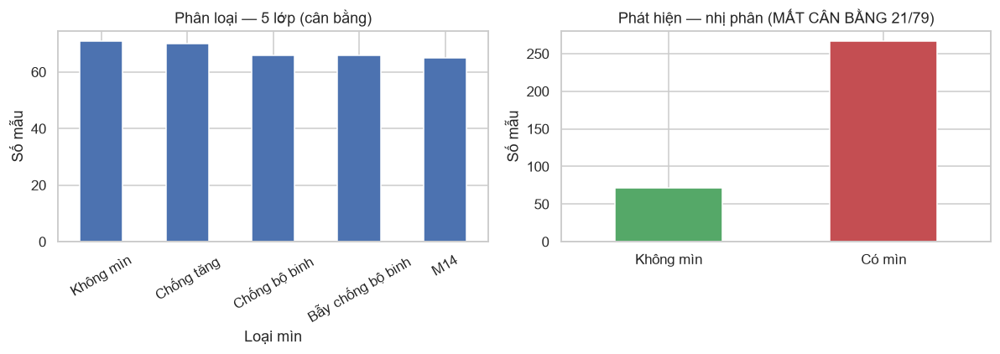 | 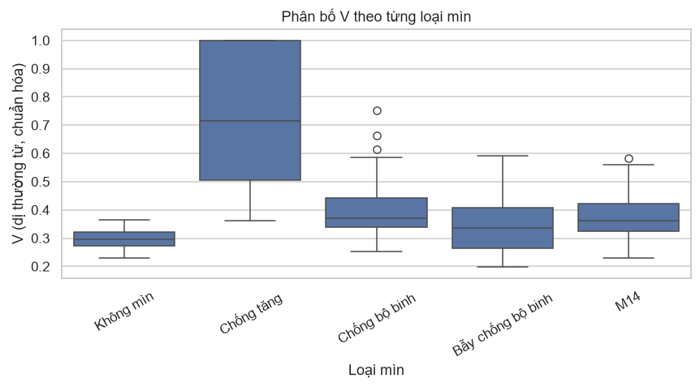 |
| 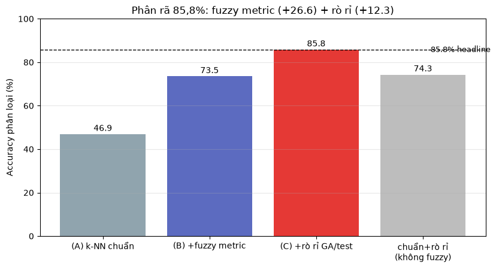 | 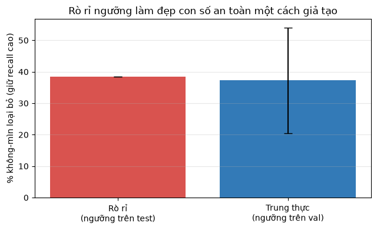 |
| 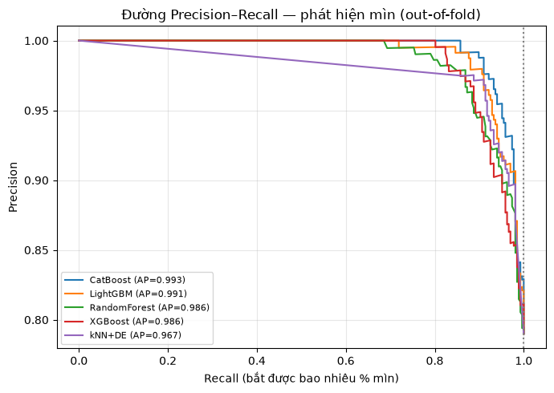 | 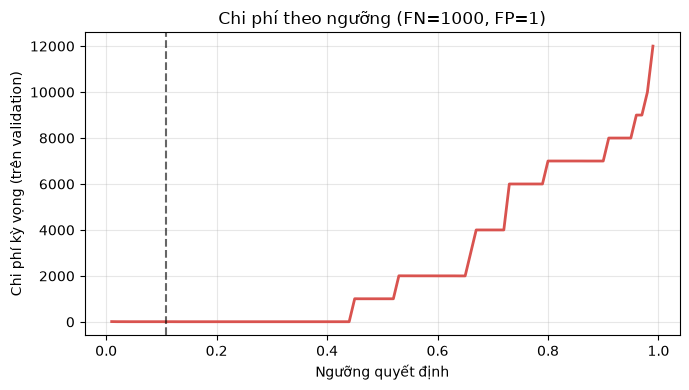 |
| 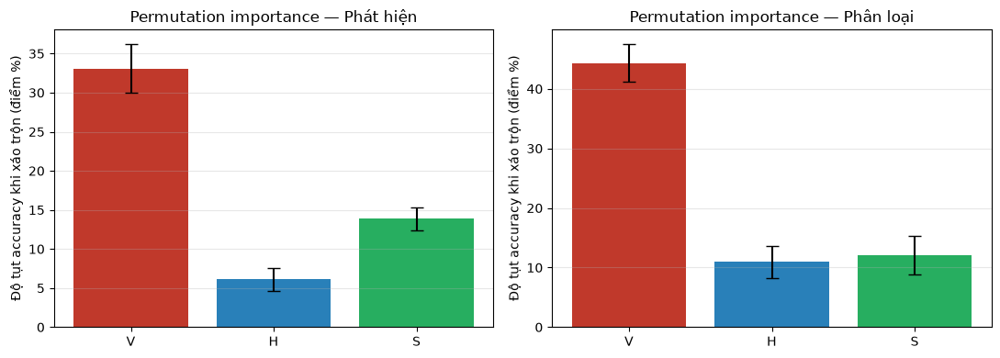 |  |

---

## Docker

```bash
cd Notebook/product_v3
docker build -t hnl206-uxo .
docker run -p 8501:8501 hnl206-uxo
# → http://localhost:8501
```

---

## Giới hạn và hướng phát triển

**Giới hạn:**
- Dữ liệu phòng thí nghiệm, không có nhiễu nền kim loại
- 30 vật thể vật lý — khoảng tin cậy rộng
- Suy giảm 6–12 điểm khi chuyển loại đất mới
- 3 lớp mìn nhỏ gần như không tách được

**Hướng phát triển:**
- Thu tín hiệu sóng thô + 1D-CNN
- Biểu diễn đường cong V(H) — đã cho +8,9 điểm sơ bộ
- Conformal prediction thay ngưỡng cố định
- Tích hợp IMSMA/GIS

---

## Trích dẫn

```bibtex
@thesis{nguyen2026uxo,
  author = {Nguyễn Quang Tuấn},
  title  = {Nghiên cứu và xây dựng hệ thống hỗ trợ phát hiện, phân loại
            vật thể chôn ngầm ứng dụng học máy trong rà phá bom mìn, vật nổ},
  school = {Trường Đại học Công nghệ Thông tin và Truyền thông Việt -- Hàn},
  year   = {2026}
}
```

---

## Giấy phép

Mã nguồn: **MIT** · Dữ liệu: **CC BY 4.0** (UCI Machine Learning Repository)

---

<div align="center">

**GVHD:** TS. Phạm Nguyễn Minh Nhựt · **Đơn vị thực tập:** Công ty TNHH MTV Hữu Nghị Nam Lào 206

*Đây là công cụ nghiên cứu học thuật. Không dùng cho rà phá thực tế.*

</div>
